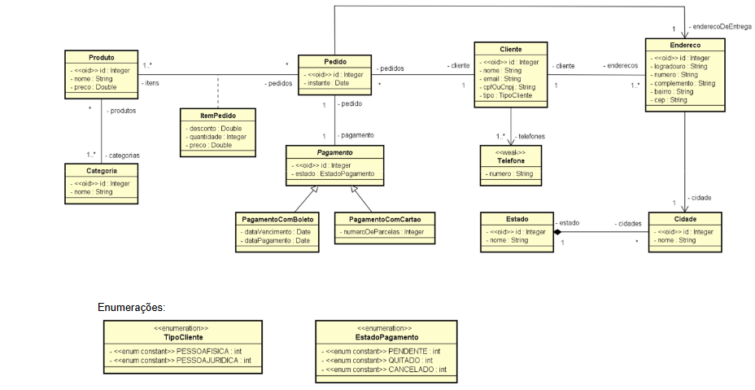

# Curso: Spring Boot com Ionic - Estudo de Caso Completo

## Objetivo geral:

O estudo de caso deste capítulo tem como objetivo demonstrar, na prática, como um modelo conceitual (modelo de domínio em nível de análise) pode ser implementado usando o paradigma orientado a objetos, aplicando padrões de mercado e boas práticas.

Vamos utilizar um modelo conceitual abrangente para ilustrar a implementação prática em linguagem orientada a objetos dos seguintes tópicos:

### Tópicos abordados:

- **Leitura e entendimento do diagrama de classes**
- **Leitura e entendimento do diagrama de objetos**
- **Associações**
    - Um para muitos / Muitos para um
    - Um para um
    - Muitos para muitos comum
    - Muitos para muitos com classe de associação
    - Bidirecionais / Direcionadas
- **Conceito independente / dependente**
- **Classe de associação**
- **Herança**
- **Enumerações**
- **Atributos Embedded (Ex.: `ItemPedidoPK`)**
- **Coleções `ElementCollection` (Ex.: Telefones de um cliente)**

### Boas práticas discutidas ao longo do capítulo:

- **Desenvolvimento em camadas**
- **Tratamento de exceções**

